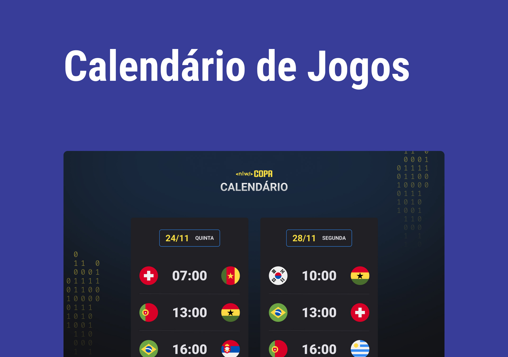

<h1 aling="center"> Projeto NLW Copa </h1>

Evento exclusivo e gratuito, promovido pela Rocketseat para ensino de tecnologias WEB.

## Tecnologias 

Esse projeto foi desenvolvido com as seguintes tecnologias:

-HTML e CSS
-JavaScript
-Git e Github

## Projeto

O Calendario da Copa é um projeto que mostra os jogos da Copa de 2022.
